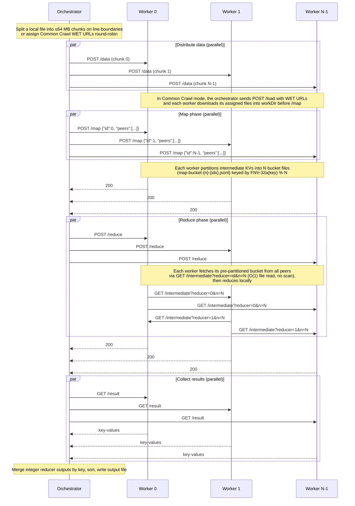
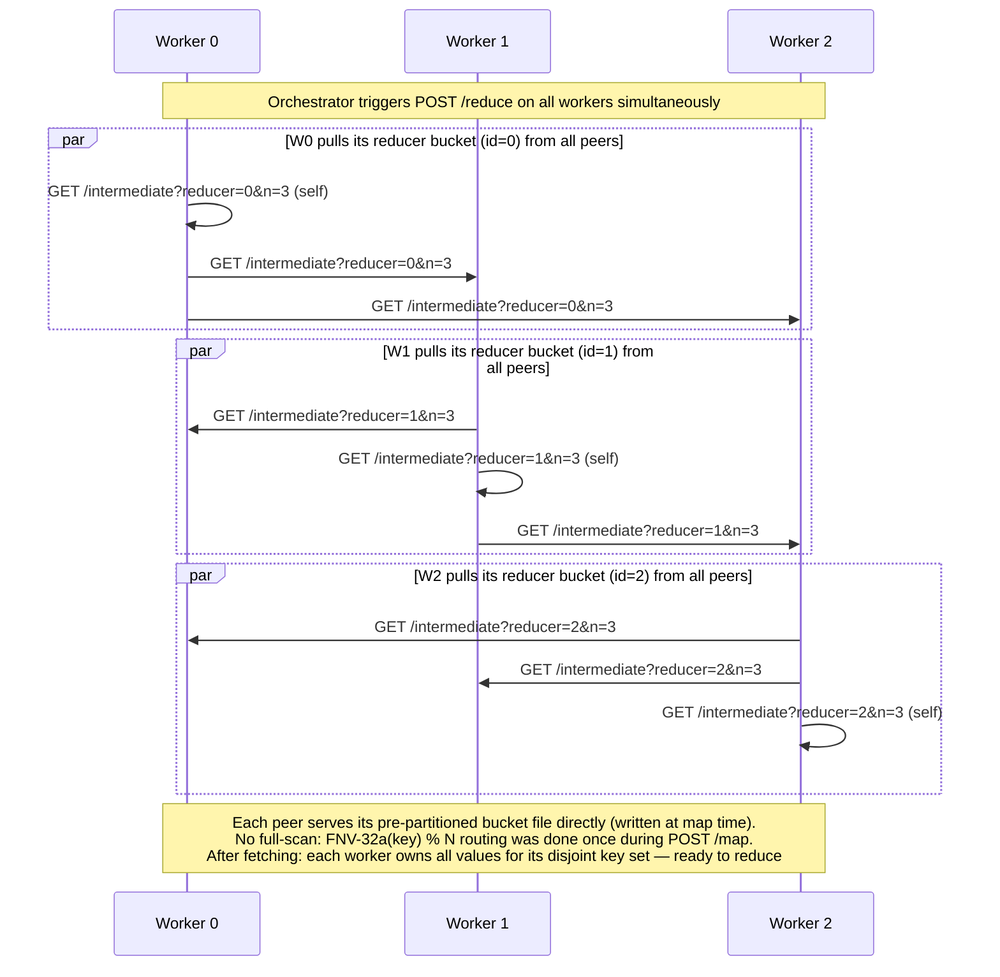

# SLR Project P4 — Distributed MapReduce

This project provides a distributed MapReduce workflow that runs across a pool
of remote lab machines (`*.enst.fr`).

---

## Repository Layout

```
.
├── hosts.txt           # Auto-generated list of available remote hosts
├── mapreduce.sh        # Entry point for the MapReduce pipeline
├── scripts/
    ├── go.mod
    ├── make_hosts/     # Fetches available hosts from tp.telecom-paris.fr
    ├── mrjob/          # Shared Mapper / Reducer interfaces for custom jobs
    ├── jobs/           # Reference and user-provided MapReduce job packages
    ├── mapreduce/      # Client-side MapReduce orchestrator
    └── worker/         # HTTP worker server (map / reduce)
└── docs/
  └── JOBS.md         # Job model and examples beyond word count
```

---

## Prerequisites

- Go 1.25+
- SSH key-based access (no password) to the remote machines
- Network access to `tp.telecom-paris.fr` (for host discovery)
- On macOS, SSH multiplexing uses `/tmp` to avoid Unix socket path-length limits

---

## Quick Start

### Custom MapReduce Job

```bash
./mapreduce.sh -job scripts/jobs/wordcount -input /path/to/data.txt -output result.txt -n 10 -port 9090
# or, from the official Common Crawl website:
./mapreduce.sh -job scripts/jobs/wordcount -commoncrawl -crawl CC-MAIN-2026-21 -files-limit 4 -output result.txt -n 10 -port 9090
```

| Flag            | Default      | Description                                                                        |
| --------------- | ------------ | ---------------------------------------------------------------------------------- |
| `-job`          | _(required)_ | Path to a Go package directory that exports `NewMapper()` and `NewReducer()`       |
| `-input`        | _(optional)_ | Path to the input text file                                                        |
| `-commoncrawl`  | _(optional)_ | Use the official Common Crawl website instead of a local file                      |
| `-crawl`        | latest crawl | Common Crawl ID override for reproducible website-backed runs                      |
| `-files-limit`  | `0`          | Cap the number of Common Crawl WET files selected (`0` = all)                      |
| `-chunks-limit` | `0`          | Second Common Crawl workload cap kept for benchmark compatibility (`0` = disabled) |
| `-output`       | `result.txt` | Path for the merged output file                                                    |
| `-n`            | `10`         | Number of worker nodes to use                                                      |
| `-port`         | `9090`       | HTTP port for worker servers                                                       |
| `-parallel`     | `16`         | Max concurrent deploy/startup/health-check SSH or SCP operations                   |

The output file contains one `word<TAB>count` line per word, sorted by
descending count then alphabetically.

`mapreduce.sh` fetches a host pool of `2 * -n` machines into `hosts.txt` so the
orchestrator has cold spares available while still running with only `-n`
active slots.

### MapReduce Jobs Beyond Word Count

The current command-line entry point selects the job package with `-job`.
Built-in jobs live under `scripts/jobs/` and currently include:

- `scripts/jobs/wordcount`
- `scripts/jobs/domainpop`
- `scripts/jobs/langdetect`
- `scripts/jobs/docdensity`

See [docs/JOBS.md](docs/JOBS.md) for the job contract and examples of non-word-count
jobs such as domain popularity, language-signal counting, and document-density
histograms.

Important current constraint: final merge expects reducer outputs whose values
are integers and sums values with the same key. Jobs that need averages or
ratios should emit summable counters, then derive the final metric after the
MapReduce output is written.

### Run All 4 Jobs On Common Crawl

The commands below run all built-in jobs against Common Crawl and store outputs
separately.

```bash
mkdir -p run/commoncrawl_jobs

./mapreduce.sh -job scripts/jobs/wordcount  -commoncrawl -crawl CC-MAIN-2026-21 -files-limit 1 -chunks-limit 1 -n 4 -output run/commoncrawl_jobs/wordcount_result.txt
./mapreduce.sh -job scripts/jobs/langdetect -commoncrawl -crawl CC-MAIN-2026-21 -files-limit 1 -chunks-limit 1 -n 4 -output run/commoncrawl_jobs/langdetect_result.txt
./mapreduce.sh -job scripts/jobs/domainpop  -commoncrawl -crawl CC-MAIN-2026-21 -files-limit 1 -chunks-limit 1 -n 4 -output run/commoncrawl_jobs/domainpop_result.txt
./mapreduce.sh -job scripts/jobs/docdensity -commoncrawl -crawl CC-MAIN-2026-21 -files-limit 1 -chunks-limit 1 -n 4 -output run/commoncrawl_jobs/docdensity_result.txt
```

If `-files-limit` (or `-chunks-limit`) is lower than `-n`, the orchestrator may
print a warning that some workers receive no URLs. The run is still valid, but
for more balanced work distribution you should increase the Common Crawl limits
or reduce `-n`.

For a one-command run of all four jobs plus automatic timing/log collection, use:

```bash
./run_all_commoncrawl_jobs.sh -crawl CC-MAIN-2026-21 -files-limit 1 -chunks-limit 1 -n 4
```

By default, it writes:

- Outputs under `run/commoncrawl_jobs/*_result.txt`
- Per-job logs under `run/commoncrawl_jobs/logs/<timestamp>/`
- Timing CSV under `run/commoncrawl_jobs/timings_<timestamp>.csv`

## Components

### `make_hosts`

Queries `https://tp.telecom-paris.fr/ajax.php` for the list of available
machines and writes the first `-n` entries to a local file.

```
make_hosts -n 10 -f hosts.txt
```

### `worker`

An HTTP server that holds the state for one MapReduce job. Started on each
remote node by the `mapreduce` orchestrator.

| Endpoint        | Method | Description                                                                                                                         |
| --------------- | ------ | ----------------------------------------------------------------------------------------------------------------------------------- |
| `/health`       | GET    | Readiness probe — returns `200 ok` when ready                                                                                       |
| `/data`         | POST   | Receive a raw text chunk (the worker's input partition)                                                                             |
| `/load`         | POST   | Accept a JSON payload of Common Crawl WET URLs; downloads them into the worker `workDir`                                            |
| `/map`          | POST   | Run the map function on the local input; body is `{"id": N, "peers": [...]}`                                                        |
| `/intermediate` | GET    | Serve the pre-partitioned map output bucket for a reducer (`?reducer=N&n=N`) — written at map time, served in O(1) without scanning |
| `/reduce`       | POST   | Pull intermediate KVs from all peers via `/intermediate`, then run the reduce function locally                                      |
| `/result`       | GET    | Download the reduce output as `key\tvalue` lines                                                                                    |

### `mapreduce` (orchestrator)

Coordinates the full pipeline from the client machine:

1. Read N hosts from `hosts.txt`
2. Build the worker binary (`GOOS=linux GOARCH=amd64`) against the required `-job` package
3. SCP the staged binary to each node, then swap it into place remotely
4. SSH each node to start the worker HTTP server (`nohup`) using SSH connection reuse
5. Wait for all workers to pass the health check with bounded parallel probes
6. Distribute input — either split a local file (`-input`) into 64 MB chunks and push them via `POST /data`, **or** resolve Common Crawl WET URLs from the official website and assign them **round-robin** across the N workers via `POST /load`. Workers download those WET files into their local `workDir`, map from local file streams, and delete the downloaded inputs after map succeeds. Bound Common Crawl runs with `-files-limit` and/or `-chunks-limit`.
7. Broadcast `POST /map` with each worker's ID and the full peer list — each worker applies the configured map function, then partitions its intermediate KVs into N bucket files (`map-bucket-{n}-{idx}.jsonl`) using `FNV-32a(key) % N`
8. Broadcast `POST /reduce` — each worker fetches its pre-partitioned bucket file from every peer via `GET /intermediate?reducer=id&n=N` (O(1) file read per peer), then runs the configured reduce function locally
9. `GET /result` from every worker, merge integer-valued outputs, sort (descending value, then alphabetical key), write output file
10. SSH cleanup: kill worker processes and remove temporary files

---

## Sequence Diagrams

### 1. MapReduce Pipeline



---

### 2. Intermediate Data Pull Detail

This diagram zooms in on how intermediate data flows during the reduce phase for a 3-worker example.



---

## MapReduce Data Flow

```
Input file
    │
    ▼  (split on newline boundaries, ≤64 MB each)
┌───────┬───────┬───────┐
│Chunk 0│Chunk 1│Chunk N│  ── POST /data ──▶  Workers
└───────┴───────┴───────┘
(or: .wet/.wet.gz files assigned round-robin ── POST /load ──▶ Workers)

Workers: Map phase
  Each worker applies the configured MapFunc line-by-line.
  For the built-in word-count job:
    "hello world hello" → [(hello,1),(world,1),(hello,1)]
    Output: N pre-partitioned bucket files on disk (map-bucket-{n}-{idx}.jsonl)
    Keys routed by FNV-32a(key) % N — partitioning done once, at map time

Workers: Reduce phase  (pull-based, no orchestrator involvement)
    Each worker i queries every peer (including itself) for its bucket:
      GET /intermediate?reducer=i&n=N
    Peers serve map-bucket-{n}-{i}.jsonl directly — O(1), no scan
    After fetching: each worker owns all values for a disjoint key set
    For the built-in word-count job: wordCountReduce(key, values) = len(values)
    Output: sorted []KeyValue

Orchestrator: Collect phase
    GET /result from all workers
    Merge totals (sum integer values across workers for same key)
    Sort: descending count, then alphabetical
    Write to output file
```

---

## Built-In Word-Count Job

| Function          | Behaviour                                                                           |
| ----------------- | ----------------------------------------------------------------------------------- |
| `Mapper.Map`      | Splits text on non-alphanumeric runes; emits `(lowercase_word, "1")` for each token |
| `Reducer.Reduce`  | Returns `len(values)` as a string (counts occurrences)                              |

The map and reduce functions are pluggable via the `MapFunc` / `ReduceFunc` type
aliases, so the worker can be adapted to other jobs. The active CLI exposes `-job`, so the orchestrator builds the worker with the
selected job package on each run. See [docs/JOBS.md](docs/JOBS.md).

---

## Building

Each script can be compiled individually:

```bash
# Build the worker binary for the local platform
cd scripts && go build -o /tmp/mr-worker ./worker/

# Build any other tool
cd scripts && go build -o /tmp/mapreduce ./mapreduce/
cd scripts && go build -o /tmp/make_hosts ./make_hosts/

# Vet everything
cd scripts && go vet ./worker/ ./mapreduce/ ./make_hosts/
```

The `mapreduce` orchestrator cross-compiles the worker automatically
(`GOOS=linux GOARCH=amd64`) before deploying it, injecting the required `-job`
package into the worker binary at build time.

---

## Benchmarking — Amdahl's Law

The `experiments/` directory contains a strong-scaling harness that runs the
**same fixed workload** while doubling the number of worker nodes
(`1, 2, 4, …, 128`), measures the **compute time** (map → reduce → collect only,
excluding build/deploy/cleanup overhead), and plots speedup against Amdahl's law.

The orchestrator emits a machine-parseable timing line at the end of each run:

```
TIMING nodes=8 map_seconds=… reduce_seconds=… collect_seconds=… compute_seconds=…
```

The fixed workload is a set of WET files split into 64 MB chunks and distributed
round-robin across the active workers, so total work stays constant as N grows.
Bound it with `-files-limit` and/or `-chunks-limit`.

### Step-by-step guide

**Prerequisites**

- The same SSH key-based access to the `*.enst.fr` hosts used by the main
  pipeline (the runner deploys workers exactly like `mapreduce.sh`).
- Network access to `tp.telecom-paris.fr` for host discovery (or a pre-built
  `experiments/bench-hosts.txt` plus the `-no-fetch` flag).
- `gnuplot` installed (only needed for `-plot` / regenerating the figure).
- Network access from the workers to `data.commoncrawl.org` and
  `index.commoncrawl.org`.

**1. Pick the fixed workload.** Choose one of:

- `-chunks-limit N` — keep a second deterministic workload cap for compatibility
  with existing benchmark flows. Use at least a few URLs per worker at the
  largest node count, e.g. `-chunks-limit 256` for a sweep that reaches 128.
- `-files-limit N` — use the first `N` WET files from the selected crawl.

**2. Run the sweep.** From the repository root:

```bash
# Recommended: sweep 1→128, 3 reps/N, and plot at the end.
experiments/run_benchmark.sh \
    -job scripts/jobs/wordcount \
    -crawl CC-MAIN-2026-05 \
    -chunks-limit 256 \
    -nodes "1 2 4 8 16 32 64 128" \
    -reps 3 \
    -plot
```

What happens for each node count `N` in the sequence:

1. The runner fetches a master host pool once (`make_hosts -n <maxN>`), then
   slices the first `N` hosts for the run.
2. It invokes the MapReduce orchestrator `-reps` times with the required `-job`
   package. Each run loads the data
   **before** starting the timer, then times only map → reduce → collect and
   prints `TIMING nodes=N … compute_seconds=…`.
3. The runner parses `compute_seconds`, validates that the orchestrator actually
   used `N` active workers (otherwise the run is discarded), and records the
   **median** of the surviving runs.

**3. Read the generated data.** The runner writes `experiments/results.csv`:

```
nodes,median_seconds,speedup,runs
1,420.300,1.0000,418.1;420.3;422.0
2,214.500,1.9594,214.0;214.5;215.2
4,110.800,3.7934,…
…
```

| Column           | Meaning                                              |
| ---------------- | ---------------------------------------------------- |
| `nodes`          | Number of active worker nodes (N)                    |
| `median_seconds` | Median compute time over the `-reps` runs            |
| `speedup`        | `median_seconds[N=1] / median_seconds[N]`            |
| `runs`           | All successful per-run compute times (`;`-separated) |

**4. Generate / regenerate the plot.** `-plot` renders `experiments/amdahl.png`
automatically. To (re)build it from an existing CSV:

```bash
gnuplot -e "datafile='experiments/results.csv'; outfile='experiments/amdahl.png'" \
    experiments/amdahl.gnuplot
```

The plot shows the measured speedup (points), a fitted Amdahl curve
`S(N) = 1 / ((1 - p) + p/N)` with the estimated parallel fraction `p`, and an
ideal linear-speedup reference. The x-axis uses a log-base-2 scale; the y-axis
is linear speedup.

**Re-running without re-fetching hosts.** To reuse the same machines across
sweeps (and skip host discovery), pass `-no-fetch` so the runner reuses the
existing `experiments/bench-hosts.txt`:

```bash
experiments/run_benchmark.sh -crawl CC-MAIN-2026-05 -chunks-limit 256 \
    -job scripts/jobs/wordcount \
    -no-fetch -plot
```

### Outputs

| Path                          | Description                                       |
| ----------------------------- | ------------------------------------------------- |
| `experiments/results.csv`     | Per-N median compute time and speedup             |
| `experiments/amdahl.png`      | Amdahl's-law plot (with `-plot`)                  |
| `experiments/bench-hosts.txt` | Master host pool (regenerated unless `-no-fetch`) |

### Flags

| Flag            | Default                   | Purpose                                                 |
| --------------- | ------------------------- | ------------------------------------------------------- |
| `-job`          | _(required)_              | Go job package directory to build into the worker       |
| `-crawl`        | latest crawl              | Common Crawl ID override                                |
| `-files-limit`  | 0                         | Cap number of WET files (fixed workload)                |
| `-chunks-limit` | 0                         | Second workload cap kept for compatibility              |
| `-nodes`        | `1 2 4 8 16 32 64 128`    | Space-separated node counts to sweep                    |
| `-reps`         | 3                         | Timed runs per node count (median reported)             |
| `-port`         | 9090                      | Worker HTTP port                                        |
| `-out`          | `experiments/results.csv` | Output CSV path                                         |
| `-plot`         | _(off)_                   | Render `experiments/amdahl.png` after the sweep         |
| `-no-fetch`     | _(off)_                   | Reuse `experiments/bench-hosts.txt` (skip `make_hosts`) |

> **Download note:** Common Crawl files are downloaded by workers during `/load`,
> before the timer starts, so the benchmark still measures map → reduce → collect
> rather than website download time.

> **Methodology note:** each run uses exactly N active workers and **no spares**,
> so the measurements reflect pure compute scaling. A run is discarded (not
> recorded) if it fails or if the orchestrator reports a different active node
> count than requested (e.g. fewer healthy workers); the median is taken over the
> surviving runs. The data-load/upload step runs _before_ the timer, so only the
> map → reduce → collect compute time contributes to the speedup.

---

## Error Handling & Fault Tolerance

The orchestrator uses a **slot-based coordinator** with a **spare pool**:

- `N` (target `-n`) logical slots initially map 1:1 to physical hosts.
  Partitioning uses `FNV-32a(key) % N`, so `N` is fixed for the duration of
  the job even if failures later force multiple slots onto the same host.
- Hosts beyond `N` in `hosts.txt` become **cold spares** — they are not
  deployed at startup, and are deployed only if a slot host must be replaced.
- Every worker call (`/load`, `/map`, `/reduce`, `/result`) is bound to a
  `context.Context` so it can be cancelled promptly.
- A background **health watcher** polls `GET /health` on every active slot host
  every `-health-interval` (default 5 s). Two consecutive failures mark a host
  dead so it will not be reused.

| Scenario                                                    | Behaviour                                                                                                                                                |
| ----------------------------------------------------------- | -------------------------------------------------------------------------------------------------------------------------------------------------------- |
| Worker not reachable at startup                             | Startup deploys only enough workers to fill `-n`; each candidate gets `waitHealthy` 6× / 2 s with a 5 s per-probe timeout, and later hosts remain cold spares |
| SCP / SSH failure (deploy)                                  | Failed hosts are skipped; deployment continues with the hosts that came up successfully                                                                  |
| Worker returns 5xx during map/reduce                        | Calling host is replaced from a cold spare when available (deploy + health-check on demand), otherwise the slot is rebound to a surviving healthy worker; `/load` → `/map` (→ `/reduce`) replay |
| Worker dies → peer's `/reduce` 5xx with `fetch from slot X` | Coordinator blames slot `X` (not the caller), reassigns it, then re-runs `/reduce` on all surviving slots with the updated peer list                    |
| Transport error / timeout on a slot                         | Same as above; the failed slot is moved to a cold spare or surviving worker                                                                              |
| Map/reduce phase times out                                  | 60 min HTTP client timeout per worker; failure triggers slot replacement                                                                                 |
| Data upload times out                                       | 30 min HTTP client timeout for `/load`; failure triggers slot replacement                                                                                |
| `/intermediate` fetch failure                               | 10 min worker-internal timeout; worker returns 500 to its `/reduce` caller; orchestrator identifies the dead peer                                        |

### Tunable flags (orchestrator)

| Flag               | Default | Purpose                                                         |
| ------------------ | ------- | --------------------------------------------------------------- |
| `-n`               | 0       | Target number of active slots; extras in `hosts.txt` are cold spares |
| `-commoncrawl`     | false   | Use the official Common Crawl website instead of a local file   |
| `-crawl`           | latest  | Override the Common Crawl ID for deterministic runs             |
| `-files-limit`     | 0       | Cap the number of Common Crawl WET files selected               |
| `-chunks-limit`    | 0       | Second Common Crawl workload cap kept for compatibility         |
| `-max-attempts`    | 4       | Per-slot host swaps before failing the job                      |
| `-health-interval` | 5s      | `/health` poll cadence during long phases                       |
| `-backoff-initial` | 250ms   | First retry backoff (doubles, capped at 5 s)                    |

### When the job will still fail

- A slot fails and there is neither a spare nor any surviving healthy worker left to absorb it.
- All workers fail their initial `/health` check.
- A single slot trips `-max-attempts` swaps.
