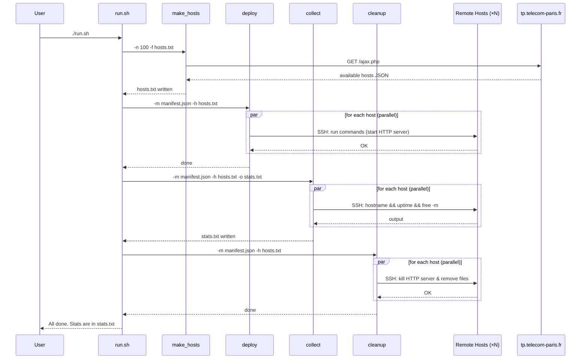
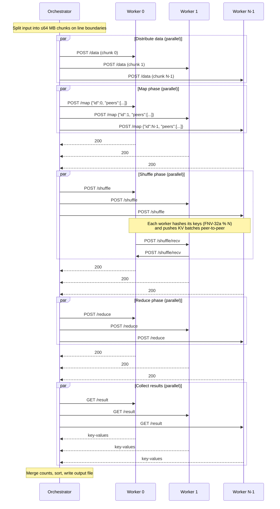
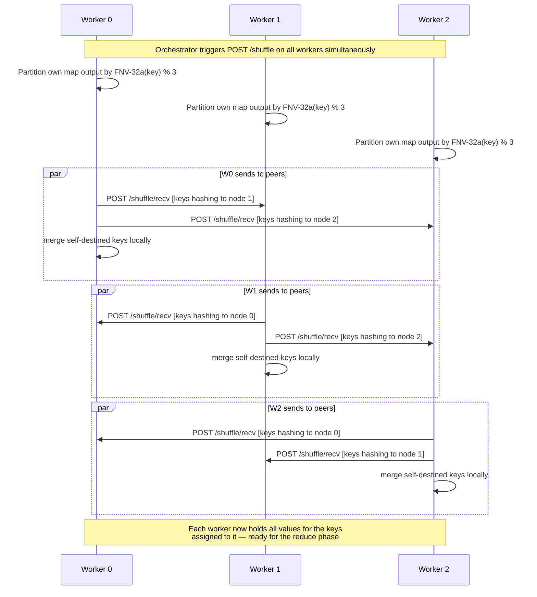

# SLR Project P4 — Distributed MapReduce & Remote Stats Collection

This project provides two independent distributed workflows that operate over a
pool of remote lab machines (`*.enst.fr`):

| Script         | Purpose                                                                    |
| -------------- | -------------------------------------------------------------------------- |
| `mapreduce.sh` | Run a distributed **word-count MapReduce** job across N remote workers     |
| `run.sh`       | Deploy an HTTP server to remote hosts, collect system stats, then clean up |

Both workflows are written in Go and share a common `hosts.txt` discovery mechanism.

---

## Repository Layout

```
.
├── manifest.json       # Configuration for deploy/collect/cleanup tools
├── hosts.txt           # Auto-generated list of available remote hosts
├── mapreduce.sh        # Entry point for the MapReduce pipeline
├── run.sh              # Entry point for the stats-collection pipeline
└── scripts/
    ├── go.mod
    ├── make_hosts/     # Fetches available hosts from tp.telecom-paris.fr
    ├── deploy/         # Copies files to NFS and runs commands via SSH
    ├── collect/        # Collects stats from remote hosts via SSH
    ├── cleanup/        # Runs cleanup commands and removes NFS files
    ├── mapreduce/      # Client-side MapReduce orchestrator
    └── worker/         # HTTP worker server (map / shuffle / reduce)
```

---

## Prerequisites

- Go 1.25+
- SSH key-based access (no password) to the remote machines
- Network access to `tp.telecom-paris.fr` (for host discovery)

---

## Quick Start

### Word-Count MapReduce

```bash
./mapreduce.sh -input /path/to/data.txt -output result.txt -n 10 -port 9090
```

| Flag      | Default      | Description                     |
| --------- | ------------ | ------------------------------- |
| `-input`  | _(required)_ | Path to the input text file     |
| `-output` | `result.txt` | Path for the merged output file |
| `-n`      | `10`         | Number of worker nodes to use   |
| `-port`   | `9090`       | HTTP port for worker servers    |

The output file contains one `word<TAB>count` line per word, sorted by
descending count then alphabetically.

### Remote Stats Collection

```bash
./run.sh
```

Connects to 100 hosts, starts an HTTP server on each, collects `hostname`,
`uptime`, and memory stats, writes them to `stats.txt`, and cleans everything
up on exit.

---

## Configuration — `manifest.json`

```json
{
  "nfs": "",
  "files": [],
  "n": 10,
  "worker_port": "9090",
  "commands": [
    "nohup python3 -m http.server 8080 </dev/null >/tmp/httpserver.log 2>&1 & echo $! > /tmp/httpserver.pid"
  ],
  "collect_commands": ["hostname", "uptime", "free -m | head -2"],
  "cleanup_commands": [
    "kill $(cat /tmp/httpserver.pid) 2>/dev/null || true",
    "rm -f /tmp/httpserver.pid /tmp/httpserver.log",
    "kill $(cat /tmp/mr-worker.pid) 2>/dev/null || true",
    "rm -f /tmp/mr-worker.pid /tmp/mr-worker.log /tmp/mr-worker"
  ]
}
```

| Field              | Used by             | Description                                   |
| ------------------ | ------------------- | --------------------------------------------- |
| `nfs`              | `deploy`, `cleanup` | SCP destination for shared files              |
| `files`            | `deploy`, `cleanup` | Local files to copy to the NFS share          |
| `n`                | all                 | Max number of hosts (0 = all)                 |
| `commands`         | `deploy`            | Shell commands run on each host after deploy  |
| `collect_commands` | `collect`           | Commands whose output is saved to `stats.txt` |
| `cleanup_commands` | `cleanup`           | Commands run on each host to clean up         |

---

## Components

### `make_hosts`

Queries `https://tp.telecom-paris.fr/ajax.php` for the list of available
machines and writes the first `-n` entries to a local file.

```
make_hosts -n 10 -f hosts.txt
```

### `deploy`

Copies files to an NFS share (via `scp`) and then SSH-executes `commands`
on each host in parallel.

```
deploy -m manifest.json -h hosts.txt
```

### `collect`

SSH-runs `collect_commands` on each host in parallel and writes a
per-host report to an output file.

```
collect -m manifest.json -h hosts.txt -o stats.txt
```

### `cleanup`

SSH-runs `cleanup_commands` on each host in parallel and removes deployed
files from the NFS share.

```
cleanup -m manifest.json -h hosts.txt
```

### `worker`

An HTTP server that holds the state for one MapReduce job. Started on each
remote node by the `mapreduce` orchestrator.

| Endpoint        | Method | Description                                                                  |
| --------------- | ------ | ---------------------------------------------------------------------------- |
| `/health`       | GET    | Readiness probe — returns `200 ok` when ready                                |
| `/data`         | POST   | Receive a raw text chunk (the worker's input partition)                      |
| `/map`          | POST   | Run the map function on the local input; body is `{"id": N, "peers": [...]}` |
| `/shuffle/recv` | POST   | Accept a batch of `[{"key":…,"value":…}]` KV pairs from a peer               |
| `/shuffle`      | POST   | Push locally-mapped KVs to the correct peer via FNV-32a hash partitioning    |
| `/reduce`       | POST   | Run the reduce function on all accumulated intermediate KVs                  |
| `/result`       | GET    | Download the reduce output as `key\tvalue` lines                             |

### `mapreduce` (orchestrator)

Coordinates the full pipeline from the client machine. Builds and deploys the
worker binary, then drives each phase.

---

## Sequence Diagrams

### 1. Stats-Collection Pipeline (`run.sh`)



---

### 2. MapReduce Pipeline



---

### 3. Worker Shuffle Detail

This diagram zooms in on the peer-to-peer shuffle step for a 3-worker example.



---

## MapReduce Data Flow

```
Input file
    │
    ▼  (split on newline boundaries, ≤64 MB each)
┌───────┬───────┬───────┐
│Chunk 0│Chunk 1│Chunk N│  ── POST /data ──▶  Workers
└───────┴───────┴───────┘

Workers: Map phase
    Each worker applies wordCountMap line-by-line:
    "hello world hello" → [(hello,1),(world,1),(hello,1)]
    Output: map[key][]value stored in-memory

Workers: Shuffle phase  (peer-to-peer, no orchestrator involvement)
    key → target = FNV-32a(key) % N
    Batch-push KVs to the owning worker via POST /shuffle/recv
    After shuffle: each worker owns all values for a disjoint key set

Workers: Reduce phase
    wordCountReduce(key, values) = len(values)
    Output: sorted []KeyValue

Orchestrator: Collect phase
    GET /result from all workers
    Merge totals (sum counts across workers for same key)
    Sort: descending count, then alphabetical
    Write to output file
```

---

## Word-Count Functions

| Function          | Signature                    | Behaviour                                                                           |
| ----------------- | ---------------------------- | ----------------------------------------------------------------------------------- |
| `wordCountMap`    | `(docID, text) → []KeyValue` | Splits text on non-alphanumeric runes; emits `(lowercase_word, "1")` for each token |
| `wordCountReduce` | `(key, []string) → string`   | Returns `len(values)` as a string (counts occurrences)                              |

The map and reduce functions are pluggable via the `MapFunc` / `ReduceFunc` type
aliases, so the worker can be adapted to other jobs.

---

## Building

Each script can be compiled individually:

```bash
# Build the worker binary for the local platform
cd scripts && go build -o /tmp/mr-worker ./worker/

# Build any other tool
cd scripts && go build -o /tmp/mapreduce ./mapreduce/
cd scripts && go build -o /tmp/deploy    ./deploy/
cd scripts && go build -o /tmp/collect   ./collect/
cd scripts && go build -o /tmp/cleanup   ./cleanup/
cd scripts && go build -o /tmp/make_hosts ./make_hosts/

# Vet everything
cd scripts && go vet ./worker/ ./mapreduce/ ./deploy/ ./collect/ ./cleanup/ ./make_hosts/
```

The `mapreduce` orchestrator cross-compiles the worker automatically
(`GOOS=linux GOARCH=amd64`) before deploying it.

---

## Error Handling & Fault Tolerance

| Scenario                         | Behaviour                                                          |
| -------------------------------- | ------------------------------------------------------------------ |
| Worker not reachable at startup  | `waitHealthy` retries up to 30 times with 2 s delay before failing |
| SCP / SSH failure                | `deployWorker` reports the first error and aborts the pipeline     |
| Worker returns non-200           | Orchestrator logs the error body and aborts the phase              |
| Shuffle send failure             | Worker responds 500 to the `/shuffle` call; orchestrator aborts    |
| `run.sh` receives SIGINT/SIGTERM | `trap cleanup EXIT` ensures remote processes are killed            |
