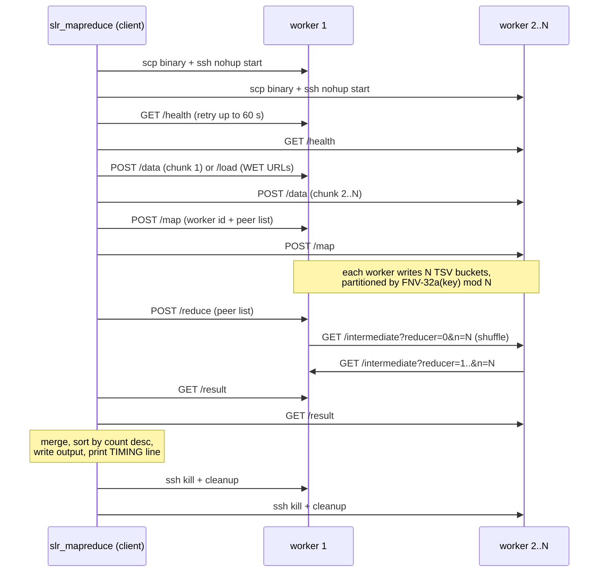

# SLR — Distributed MapReduce in C++

A distributed MapReduce system written in **C++20**, designed to run on the
school lab machines (`*.enst.fr`). It deploys worker processes over SSH, splits
input data across them, runs a map → shuffle → reduce pipeline over plain
HTTP/TCP, and merges the results locally.

The project also includes standalone cluster utilities (host discovery, server
deployment, load-stats collection, cleanup) and a Kafka Streams comparison job.

---

## Repository layout

```
.
├── README.md
├── manifest.json               # deployment manifest (n, port, paths…)
├── hosts.txt                   # generated list of reachable lab hosts
├── run.sh                      # stats pipeline: hosts → deploy → collect → cleanup
├── mapreduce.sh                # MapReduce pipeline wrapper
├── test_input.txt              # small input for local testing
├── cpp/
│   ├── CMakeLists.txt          # optional CMake build
│   └── src/
│       ├── common.hpp/.cpp     # shared helpers (exec, ssh, parallel_for, I/O)
│       ├── job.hpp/.cpp        # built-in jobs: map_line / reduce_values / hashing
│       ├── slr_make_hosts.cpp  # host discovery tool
│       ├── slr_deploy.cpp      # load-server deployment tool
│       ├── slr_collect.cpp     # stats collection tool
│       ├── slr_cleanup.cpp     # remote cleanup tool
│       ├── slr_worker.cpp      # MapReduce worker (HTTP server)
│       └── slr_mapreduce.cpp   # MapReduce orchestrator (client)
├── scripts/
│   ├── build_cpp.sh            # builds all binaries into bin/
│   ├── build_remote_worker.sh  # builds lab-compatible slr_worker remotely
│   └── test_distributed.sh     # local multi-worker end-to-end test
├── bin/                        # compiled binaries (created by build_cpp.sh)
├── experiments/
│   ├── run_benchmark.sh        # MapReduce scaling benchmark (Amdahl)
│   ├── run_deploy_benchmark.sh # deploy/collect scaling benchmark
│   └── amdahl.gnuplot          # plot speedup curves
├── kafka/                      # Kafka Streams word-count comparison
└── docs/REPORT.md              # project report
```

---

## Prerequisites

- **g++ 13+** (C++20). CMake ≥ 3.16 is optional — the build script falls back
  to direct `g++` invocation if CMake is absent.
- **curl**, **jq**, **gzip** on the local machine (the tools shell out to them
  for HTTP requests, JSON parsing, and WET-file decompression).
- Passwordless **SSH** access to the lab hosts (`ssh <login>@<host>.enst.fr`
  must work without a prompt; an SSH agent or key is required since all
  connections use `BatchMode=yes`).

## Build

```bash
scripts/build_cpp.sh
```

This produces six binaries in `bin/`:

| Binary | Purpose |
| --- | --- |
| `bin/slr_make_hosts` | Probe lab DNS and write `hosts.txt` with N reachable hosts |
| `bin/slr_deploy` | Copy & start the load server on every host (stats pipeline) |
| `bin/slr_collect` | Fetch CPU-load/memory stats from every host into `stats.txt` |
| `bin/slr_cleanup` | Kill remote servers and remove deployed files |
| `bin/slr_worker` | MapReduce worker: HTTP server executing map/reduce locally |
| `bin/slr_worker_remote` | Lab-compatible worker built on a remote Debian host |
| `bin/slr_mapreduce` | MapReduce orchestrator: deploys workers, drives the pipeline |

The lab machines currently run an older glibc/libstdc++ than the local laptop.
`mapreduce.sh` therefore builds `bin/slr_worker_remote` on the first selected
lab host before deployment when the worker is missing or stale. This keeps the
orchestrator local while ensuring the remote worker binary matches the lab
runtime.

---

## Quick start

### 1. Cluster stats pipeline

```bash
./run.sh
```

Fetches up to 100 reachable hosts, deploys an HTTP load server on each,
collects 1/5/15-minute load averages and memory stats into `stats.txt`, then
cleans everything up (also on Ctrl-C, via an EXIT trap).

### 2. MapReduce on a local file

```bash
./mapreduce.sh -job wordcount -input test_input.txt -output result.txt -n 10
```

### 3. MapReduce on Common Crawl

```bash
./mapreduce.sh -job langdetect -commoncrawl -files-limit 20 -output langs.txt -n 10
```

Workers download WET chunks directly from `data.commoncrawl.org` (the
orchestrator only ships URLs, never the data itself).

### 4. Local end-to-end test (no SSH needed)

```bash
scripts/test_distributed.sh -n 3
```

Starts 3 workers on localhost, runs the full distributed pipeline over real
TCP, and diffs the merged output against an independently computed reference
word count. Exits non-zero on any mismatch.

---

## Built-in jobs

Jobs are **compiled into the worker binary** and selected at runtime with
`-job <name>`:

| Job | Emits | Description |
| --- | --- | --- |
| `wordcount` | `word → count` | Classic word count (lowercase, alphanumeric tokens) |
| `langdetect` | `lang:<code> → docs` | Per-document language guess (en/fr/de/es/it) via stop-word scoring |
| `domainpop` | `host → pages` | Domain popularity from WET `WARC-Target-URI` headers |
| `docdensity` | `stat:*`, `hist:*` | Document/word statistics and word-per-document histogram |

Adding a job means adding a `JobKind`, its map/reduce logic in
`cpp/src/job.cpp`, and rebuilding — every worker then supports it.

---

## `mapreduce.sh` flags

| Flag | Default | Description |
| --- | --- | --- |
| `-job <name>` | *(required)* | One of `wordcount`, `langdetect`, `domainpop`, `docdensity` |
| `-input <file>` | — | Local input file (mutually exclusive with `-commoncrawl`) |
| `-commoncrawl` | off | Use Common Crawl WET files as input |
| `-crawl <id>` | latest | Specific crawl, e.g. `CC-MAIN-2026-05` |
| `-files-limit <n>` | 0 = all | Limit number of WET files |
| `-chunks-limit <n>` | 0 = all | Limit total chunks distributed |
| `-output <file>` | `result.txt` | Merged result destination |
| `-n <n>` | 10 | Number of worker nodes |
| `-port <p>` | 9090 | Worker HTTP port |

`bin/slr_mapreduce` accepts the same flags plus `-hosts <file>`,
`-parallel <n>` (SSH/HTTP fan-out, default 16) and `-worker-pprof`.

---

## How the MapReduce pipeline works



1. **Deploy** — the client `scp`s `bin/slr_worker_remote` when present
  (falling back to `bin/slr_worker`) to each host as a user-scoped path under
  `/tmp`, then starts it with `nohup … -port <p> -job <name>`, recording a
  matching PID file.
2. **Health** — polls `GET /health` until every worker answers (30 × 2 s).
3. **Input** — local files are split into ≤ 64 MB newline-aligned chunks and
   `POST /data`-ed round-robin; in Common Crawl mode the client resolves the
   crawl's `wet.paths.gz` and `POST /load`s URL lists for workers to download.
4. **Map** — `POST /map` carries the worker's id and the peer list as plain
   text lines. Each worker maps its chunk and writes one TSV bucket file per
   reducer (`map-bucket-<reducer>-<chunk>.tsv`), routing each key with the
   FNV-32a hash — so a given key always lands on the same reducer.
5. **Shuffle + Reduce** — on `POST /reduce` every worker pulls its own buckets
   from all peers via `GET /intermediate`, groups values by key, and applies
   the job's reduce function.
6. **Collect** — the client fetches `GET /result` (TSV) from every worker,
   merges the counts, sorts by count (desc) then key, and writes the output
   file. It then prints a machine-readable timing line consumed by the
   benchmark scripts:

   ```
   TIMING nodes=N map_seconds=… reduce_seconds=… collect_seconds=… compute_seconds=…
   ```
7. **Cleanup** — workers are killed and the user-scoped worker files are removed over SSH,
   on both success and failure paths.

### Worker HTTP API

| Method & path | Body / params | Action |
| --- | --- | --- |
| `GET /health` | — | Returns `ok` |
| `POST /data` | raw text | Store input chunk |
| `POST /load` | WET URLs, one per line | Download + decompress inputs |
| `POST /map` | worker id, then peers (one per line) | Run map, write partition buckets |
| `GET /intermediate?reducer=i&n=N` | — | Serve TSV bucket destined for reducer *i* |
| `POST /reduce` | peers, one per line | Pull buckets from all peers, reduce |
| `GET /result` | — | Final TSV (`key\tvalue` per line) |

The worker is a thread-per-connection HTTP server built on raw POSIX sockets —
no external networking libraries. All payloads are plain text (line-oriented
or TSV), so every step is debuggable with `curl`.

---

## Stats pipeline tools

Each tool reads `manifest.json` (via `jq`) for defaults and accepts:

```bash
bin/slr_make_hosts -n 100 -f hosts.txt        # probe DNS, keep reachable hosts
bin/slr_deploy     -m manifest.json -h hosts.txt
bin/slr_collect    -m manifest.json -h hosts.txt -o stats.txt
bin/slr_cleanup    -m manifest.json -h hosts.txt
```

`manifest.json` fields: `n` (host count), `port`, `server_binary`,
`remote_path`, `pid_file`, and the stats endpoints. All SSH connections use
multiplexing (`ControlMaster=auto`, `ControlPersist=60s`) and run with a
configurable fan-out (default 16 concurrent hosts).

---

## Benchmarks

```bash
# MapReduce scaling: runs the pipeline for several node counts and
# parses the TIMING line into a CSV for the Amdahl plot.
experiments/run_benchmark.sh

# Deploy/collect scaling for the stats pipeline.
experiments/run_deploy_benchmark.sh

# Plot speedup curves.
gnuplot experiments/amdahl.gnuplot
```

The Kafka Streams comparison lives in `kafka/` — see `kafka/README.md`.

---

## Notes on the C++ implementation

Key design choices:

- **Compiled-in jobs**: the worker binary embeds all four jobs and selects one
  with `-job`.
- **Plain-text line protocol** instead of JSON bodies: worker endpoints accept
  and return newline-separated text/TSV, parsed without a JSON library.
- **Shell delegation**: HTTP client calls use `curl`, JSON manifest parsing
  uses `jq`, and decompression uses `gzip` — keeping the C++ code dependency-free.
- **Concurrency** via `std::thread` + a small `parallel_for` helper (with
  exception propagation); the worker handles each connection on a detached
  thread.
- **Remote-compatible worker builds**: the local orchestrator can be built on
  the laptop, while `scripts/build_remote_worker.sh` compiles the deployed
  worker on a lab host to avoid glibc/libstdc++ version mismatches.
