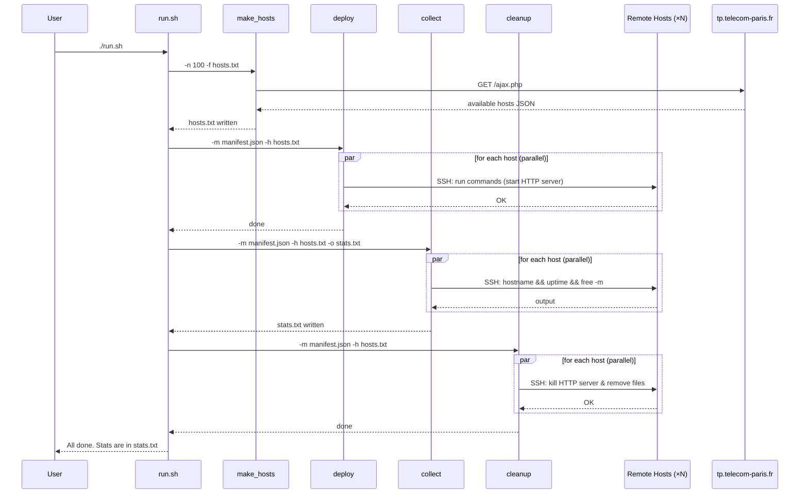
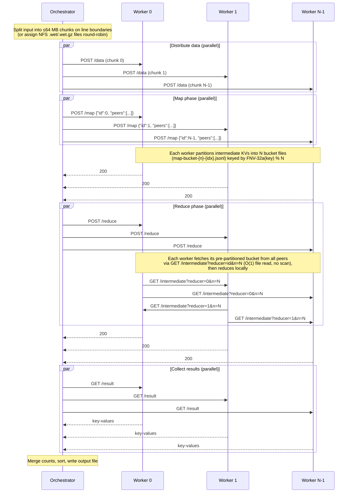
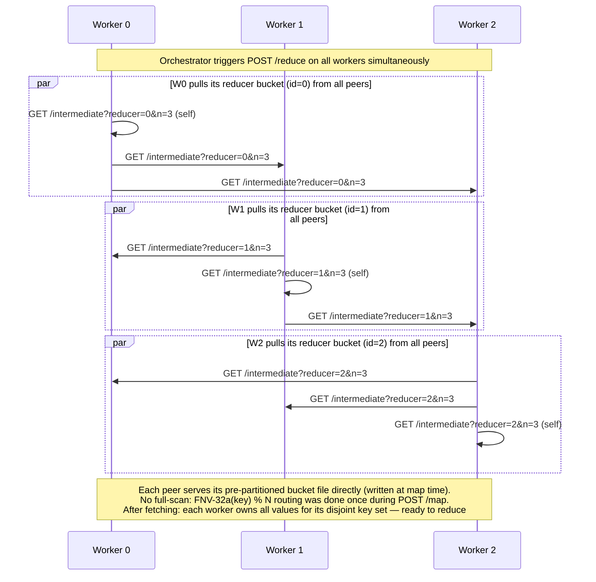

# SLR Project P4 — Distributed MapReduce & Remote Stats Collection

This project provides two independent distributed workflows that operate over a
pool of remote lab machines (`*.enst.fr`):

| Script         | Purpose                                                                    |
| -------------- | -------------------------------------------------------------------------- |
| `mapreduce.sh` | Run a distributed **word-count MapReduce** job across N remote workers     |
| `run.sh`       | Deploy an HTTP server to remote hosts, collect system stats, then clean up |

Both workflows are written in Go and share a common `hosts.txt` discovery mechanism.

---

## Repository Layout

```
.
├── manifest.json       # Configuration for deploy/collect/cleanup tools
├── hosts.txt           # Auto-generated list of available remote hosts
├── mapreduce.sh        # Entry point for the MapReduce pipeline
├── run.sh              # Entry point for the stats-collection pipeline
└── scripts/
    ├── go.mod
    ├── make_hosts/     # Fetches available hosts from tp.telecom-paris.fr
    ├── deploy/         # Copies files to NFS and runs commands via SSH
    ├── collect/        # Collects stats from remote hosts via SSH
    ├── cleanup/        # Runs cleanup commands and removes NFS files
    ├── mapreduce/      # Client-side MapReduce orchestrator
    └── worker/         # HTTP worker server (map / reduce)
```

---

## Prerequisites

- Go 1.25+
- SSH key-based access (no password) to the remote machines
- Network access to `tp.telecom-paris.fr` (for host discovery)

---

## Quick Start

### Word-Count MapReduce

```bash
./mapreduce.sh -input /path/to/data.txt -output result.txt -n 10 -port 9090
# or, for a directory of WET/WET.gz files on NFS:
./mapreduce.sh -input-dir /cal/commoncrawl -output result.txt -n 10 -port 9090
```

| Flag          | Default      | Description                                                              |
| ------------- | ------------ | ------------------------------------------------------------------------ |
| `-input`      | _(optional)_ | Path to the input text file (one of `-input` or `-input-dir` required)  |
| `-input-dir`  | _(optional)_ | Directory of `.wet`/`.wet.gz` files on NFS (alternative to `-input`)    |
| `-output`     | `result.txt` | Path for the merged output file                                          |
| `-n`          | `10`         | Number of worker nodes to use                                            |
| `-port`       | `9090`       | HTTP port for worker servers                                             |

The output file contains one `word<TAB>count` line per word, sorted by
descending count then alphabetically.

### Remote Stats Collection

```bash
./run.sh
```

Connects to 100 hosts, starts an HTTP server on each, collects `hostname`,
`uptime`, and memory stats, writes them to `stats.txt`, and cleans everything
up on exit.

---

## Configuration — `manifest.json`

```json
{
  "nfs": "",
  "files": [],
  "n": 100,
  "commands": [
    "nohup python3 -m http.server 8080 </dev/null >/tmp/httpserver.log 2>&1 & echo $! > /tmp/httpserver.pid"
  ],
  "collect_commands": ["hostname", "uptime", "free -m | head -2"],
  "cleanup_commands": [
    "kill $(cat /tmp/httpserver.pid) 2>/dev/null || true",
    "rm -f /tmp/httpserver.pid /tmp/httpserver.log",
    "kill $(cat /tmp/mr-worker.pid) 2>/dev/null || true",
    "rm -f /tmp/mr-worker.pid /tmp/mr-worker.log /tmp/mr-worker"
  ]
}
```

| Field              | Used by             | Description                                   |
| ------------------ | ------------------- | --------------------------------------------- |
| `nfs`              | `deploy`, `cleanup` | SCP destination for shared files              |
| `files`            | `deploy`, `cleanup` | Local files to copy to the NFS share          |
| `n`                | all                 | Max number of hosts (0 = all)                 |
| `commands`         | `deploy`            | Shell commands run on each host after deploy  |
| `collect_commands` | `collect`           | Commands whose output is saved to `stats.txt` |
| `cleanup_commands` | `cleanup`           | Commands run on each host to clean up         |

---

## Components

### `make_hosts`

Queries `https://tp.telecom-paris.fr/ajax.php` for the list of available
machines and writes the first `-n` entries to a local file.

```
make_hosts -n 10 -f hosts.txt
```

### `deploy`

Copies files to an NFS share (via `scp`) and then SSH-executes `commands`
on each host in parallel.

```
deploy -m manifest.json -h hosts.txt
```

### `collect`

SSH-runs `collect_commands` on each host in parallel and writes a
per-host report to an output file.

```
collect -m manifest.json -h hosts.txt -o stats.txt
```

### `cleanup`

SSH-runs `cleanup_commands` on each host in parallel and removes deployed
files from the NFS share.

```
cleanup -m manifest.json -h hosts.txt
```

### `worker`

An HTTP server that holds the state for one MapReduce job. Started on each
remote node by the `mapreduce` orchestrator.

| Endpoint        | Method | Description                                                                                    |
| --------------- | ------ | ---------------------------------------------------------------------------------------------- |
| `/health`       | GET    | Readiness probe — returns `200 ok` when ready                                                  |
| `/data`         | POST   | Receive a raw text chunk (the worker's input partition)                                        |
| `/load`         | POST   | Accept a JSON array of NFS file paths; reads each file (`.gz` decompressed) as input data     |
| `/map`          | POST   | Run the map function on the local input; body is `{"id": N, "peers": [...]}`                  |
| `/intermediate` | GET    | Serve the pre-partitioned map output bucket for a reducer (`?reducer=N&n=N`) — written at map time, served in O(1) without scanning |
| `/reduce`       | POST   | Pull intermediate KVs from all peers via `/intermediate`, then run the reduce function locally |
| `/result`       | GET    | Download the reduce output as `key\tvalue` lines                                               |

### `mapreduce` (orchestrator)

Coordinates the full pipeline from the client machine:

1. Read N hosts from `hosts.txt`
2. Build the worker binary (`GOOS=linux GOARCH=amd64`)
3. SCP the binary to each node
4. SSH each node to start the worker HTTP server (`nohup`)
5. Wait for all workers to pass the health check
6. Distribute input — either split a local file into 64 MB chunks and `POST /data` to each worker, or assign `.wet`/`.wet.gz` files round-robin and `POST /load` (workers read from NFS)
7. Broadcast `POST /map` with each worker's ID and the full peer list — each worker partitions its intermediate KVs into N bucket files (`map-bucket-{n}-{idx}.jsonl`) using `FNV-32a(key) % N`
8. Broadcast `POST /reduce` — each worker fetches its pre-partitioned bucket file from every peer via `GET /intermediate?reducer=id&n=N` (O(1) file read per peer) and runs reduce locally
9. `GET /result` from every worker, merge word counts, sort (descending count, then alphabetical), write output file
10. SSH cleanup: kill worker processes and remove temporary files

---

## Sequence Diagrams

### 1. Stats-Collection Pipeline (`run.sh`)



---

### 2. MapReduce Pipeline



---

### 3. Intermediate Data Pull Detail

This diagram zooms in on how intermediate data flows during the reduce phase for a 3-worker example.



---

## MapReduce Data Flow

```
Input file
    │
    ▼  (split on newline boundaries, ≤64 MB each)
┌───────┬───────┬───────┐
│Chunk 0│Chunk 1│Chunk N│  ── POST /data ──▶  Workers
└───────┴───────┴───────┘
(or: .wet/.wet.gz files assigned round-robin ── POST /load ──▶ Workers)

Workers: Map phase
    Each worker applies wordCountMap line-by-line:
    "hello world hello" → [(hello,1),(world,1),(hello,1)]
    Output: N pre-partitioned bucket files on disk (map-bucket-{n}-{idx}.jsonl)
    Keys routed by FNV-32a(key) % N — partitioning done once, at map time

Workers: Reduce phase  (pull-based, no orchestrator involvement)
    Each worker i queries every peer (including itself) for its bucket:
      GET /intermediate?reducer=i&n=N
    Peers serve map-bucket-{n}-{i}.jsonl directly — O(1), no scan
    After fetching: each worker owns all values for a disjoint key set
    wordCountReduce(key, values) = len(values)
    Output: sorted []KeyValue

Orchestrator: Collect phase
    GET /result from all workers
    Merge totals (sum counts across workers for same key)
    Sort: descending count, then alphabetical
    Write to output file
```

---

## Word-Count Functions

| Function          | Signature                    | Behaviour                                                                           |
| ----------------- | ---------------------------- | ----------------------------------------------------------------------------------- |
| `wordCountMap`    | `(docID, text) → []KeyValue` | Splits text on non-alphanumeric runes; emits `(lowercase_word, "1")` for each token |
| `wordCountReduce` | `(key, []string) → string`   | Returns `len(values)` as a string (counts occurrences)                              |

The map and reduce functions are pluggable via the `MapFunc` / `ReduceFunc` type
aliases, so the worker can be adapted to other jobs.

---

## Building

Each script can be compiled individually:

```bash
# Build the worker binary for the local platform
cd scripts && go build -o /tmp/mr-worker ./worker/

# Build any other tool
cd scripts && go build -o /tmp/mapreduce ./mapreduce/
cd scripts && go build -o /tmp/deploy    ./deploy/
cd scripts && go build -o /tmp/collect   ./collect/
cd scripts && go build -o /tmp/cleanup   ./cleanup/
cd scripts && go build -o /tmp/make_hosts ./make_hosts/

# Vet everything
cd scripts && go vet ./worker/ ./mapreduce/ ./deploy/ ./collect/ ./cleanup/ ./make_hosts/
```

The `mapreduce` orchestrator cross-compiles the worker automatically
(`GOOS=linux GOARCH=amd64`) before deploying it.

---

## Error Handling & Fault Tolerance

The orchestrator uses a **slot-based coordinator** with a **spare pool**:

- `N` (target `-n`) logical slots map 1:1 to physical hosts. Partitioning
  uses `FNV-32a(key) % N`, so `N` is fixed for the duration of the job.
- Hosts beyond `N` in `hosts.txt` become **spares** — kept healthy and
  ready to replace any slot whose host fails.
- Every worker call (`/load`, `/map`, `/reduce`, `/result`) is bound to a
  `context.Context` so it can be cancelled promptly.
- A background **health watcher** polls `GET /health` on every active and
  spare host every `-health-interval` (default 5 s). Two consecutive failures
  mark a host dead so it will not be reused.

| Scenario                            | Behaviour                                                                                                          |
| ----------------------------------- | ------------------------------------------------------------------------------------------------------------------ |
| Worker not reachable at startup     | `waitHealthy` retries 30× / 2 s; survivors form slot+spare pool                                                    |
| SCP / SSH failure (deploy)          | Failed hosts are skipped; deploy throttled to 8 parallel connections                                               |
| Worker returns 5xx during map/reduce | Calling host is replaced from spare pool, slot rewinds to `pending`, `/load` → `/map` (→ `/reduce`) replay        |
| Worker dies → peer's `/reduce` 5xx with `fetch from peer X` | Coordinator parses the message, blames host `X` (not the caller), replaces `X`, then re-runs `/reduce` on all surviving slots with the updated peer list |
| Transport error / timeout on a slot | Same as above; calling host replaced                                                                               |
| Map/reduce phase times out          | 60 min HTTP client timeout per worker; failure triggers slot replacement                                            |
| Data upload times out               | 30 min HTTP client timeout for `/load`; failure triggers slot replacement                                          |
| `/intermediate` fetch failure       | 10 min worker-internal timeout; worker returns 500 to its `/reduce` caller; orchestrator identifies the dead peer  |
| `run.sh` receives SIGINT/SIGTERM    | `trap cleanup EXIT` kills remote processes                                                                          |

### Tunable flags (orchestrator)

| Flag                  | Default | Purpose                                                       |
| --------------------- | ------- | ------------------------------------------------------------- |
| `-n`                  | 0       | Target number of active slots; extras in `hosts.txt` are spares |
| `-files-limit`        | 0       | Cap the number of WET files used from `-input-dir`            |
| `-max-attempts`       | 4       | Per-slot host swaps before failing the job                    |
| `-health-interval`    | 5s      | `/health` poll cadence during long phases                     |
| `-backoff-initial`    | 250ms   | First retry backoff (doubles, capped at 5 s)                  |

### When the job will still fail

- Spare pool exhausted (more slots fail than spares can replace).
- All workers fail their initial `/health` check.
- A single slot trips `-max-attempts` swaps.

