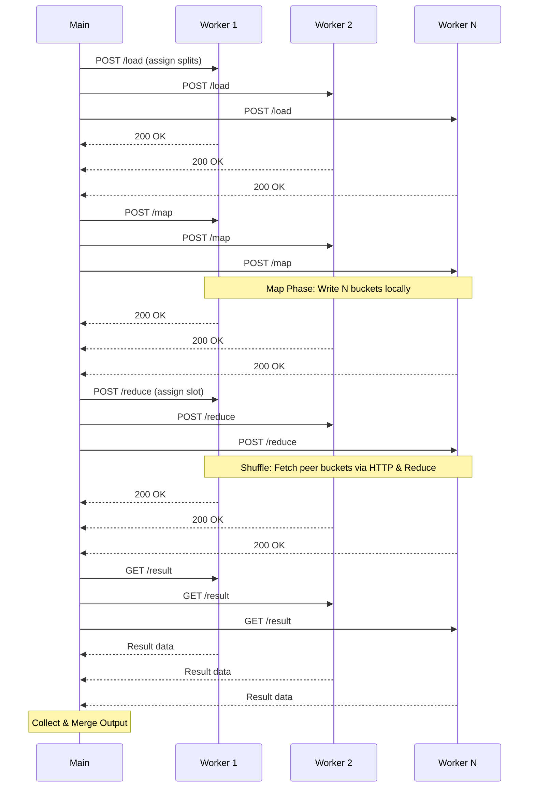

# Distributed MapReduce on Lab Machines

SLR Project P4

Custom Go MapReduce framework running on `*.enst.fr` workers, with direct Common Crawl input, pluggable jobs, local-disk shuffle, and fault-aware coordination.


---

# What We Built

- Automatic host discovery from `https://tp.telecom-paris.fr/ajax.php`
- Go orchestrator that builds, deploys, starts, monitors, and cleans workers
- HTTP worker API for `load -> map -> shuffle -> reduce -> result`
- Direct Common Crawl WET download from `data.commoncrawl.org`
- Four jobs: `wordcount`, `langdetect`, `domainpop`, `docdensity`

**Current verification:** 89 Go tests passed, live 100-host discovery passed, small reference wordcount matched exactly.


---

# Architecture

```text
User shell
  |
  v
mapreduce.sh
  |-- make_hosts -> hosts.txt
  |
  v
Go orchestrator
  |-- build worker with selected job
  |-- SCP + SSH start workers
  |-- health checks and retries
  |-- load / map / reduce / collect
  v
Remote workers on lab machines
  /health /data /load /map /intermediate /reduce /result
```

Design choice: the client is the Main. Workers are stateless between jobs except for local temporary files under `/tmp`.


---

# Protocol and Dataflow

1. **Load:** Assign file chunks or WET URLs to workers.
2. **Map:** Each worker writes `N` bucket files on local disk.
3. **Shuffle + reduce:** Reducer `i` pulls bucket `i` from peers.
4. **Collect:** Main fetches, merges, sorts, writes final output.

**Map assignment:** Orchestrator split + `POST /data`
**Reducer assignment:** `FNV-32a(key) % N`

---

# Execution Sequence



---

# Fault Tolerance and Operations

- Logical **slots** stay fixed: `0..N-1`
- Physical hosts can be replaced by cold spares
- Health watcher polls `/health` and marks repeated failures dead
- Failed slots replay prerequisites: `load -> map -> reduce`
- If a peer dies during reduce, coordinator re-runs stale reduces with the new peer list
- Cleanup is idempotent: kill PID if present, remove worker files, tolerate repeated cleanup

**Tested behavior:** coordinator replacement, peer reduce failure, cold spare activation, fallback to surviving worker.


---

# Use Cases Beyond Wordcount

| Job | What it measures | Example output |
| --- | --- | --- |
| `wordcount` | token frequency | `the 239298` |
| `langdetect` | language signal counts | `lang:en`, `lang:fr`, `lang:unknown` |
| `domainpop` | crawled domain popularity | `doi.org`, `youtube.com` |
| `docdensity` | content size and density | `stat:lines`, `hist:len.*` |

All reducers emit integer values so the orchestrator can safely merge partial outputs.

**Executing a specific job:**
```bash
# The orchestrator injects the selected job into the worker binary
./mapreduce.sh -job scripts/jobs/langdetect \
  -commoncrawl -crawl CC-MAIN-2026-21 -n 8
```

---

# Measurements and Amdahl's Law


Observed scaling on the fixed Common Crawl workload:

- `1 node`: 206.95 s, speedup 1.0
- `16 nodes`: 40.80 s, speedup 5.07
- `64 nodes`: 39.06 s, speedup 5.30

Interpretation: after the useful parallelism is exhausted, communication, synchronization, and final merge dominate. Based on Amdahl's law, the calculated **incompressible sequential part is roughly 17%** of the execution time, capping theoretical speedup at ~5.8x.

---

# Batch vs Kafka Streams

| Custom MapReduce | Kafka Streams |
| --- | --- |
| Batch job with explicit phases | Continuous stream processing model |
| Lightweight HTTP + local temp files | Persistent Kafka log and state stores |
| Fast on small bounded workloads | More operationally robust at scale |
| No HDFS-style replication | Built around durable broker storage |

Kafka path is implemented without Docker or root: KRaft deployment in `/tmp`, Java Streams wordcount, timing by consumer-group lag.


---

# Pain Points: What Broke and Why?

During development and testing at scale, we encountered major blockers:

1. **NFS Overload:** Reading input splits from `/cal/commoncrawl` via the shared NFS caused massive I/O bottlenecks when many workers started reading simultaneously.
   *Fix:* Moved to direct download from Amazon (`data.commoncrawl.org`) and enforced local `/tmp` writes for map buckets.
2. **Zombie Processes:** Killed orchestrators left orphan worker processes running on remote lab machines, locking up assigned ports.
   *Fix:* Made cleanup idempotent (matching port/process ID) and added health monitoring.

---

# What Is Missing and One-Week Plan

We will present the core system now, then harden evidence and compatibility next week.

| Gap | One-week fix |
| --- | --- |
| Exact `1 SCP to HOME + 100 SSH` rubric mode | Add compatibility deploy mode or document design choice |
| Port collision preflight | Remote port check before starting workers |
| Standalone MapReduce cleanup script | Add `clean_mapreduce.sh` using host file |
| `/cal/commoncrawl` evidence | Add input mode or document direct Amazon path as replacement |
| Local storage proof | Save `df` / `mount` evidence for lab machines |
| Large remote proof | Run and save 100-node / larger-split logs |
| Stragglers and atomic final writes | Add speculative task note or implementation, temp+rename outputs |


---

# Demo and Discussion Plan

**Live demo path**

```bash
(cd scripts && go test ./...)
./mapreduce.sh -job scripts/jobs/wordcount -input test_input.txt -n 4 -output result.txt
./run_all_commoncrawl_jobs.sh -crawl CC-MAIN-2026-21 -files-limit 1 -n 4

# Regular demonstration
./demo_regular.sh

# Fault tolerance demonstrations
./demo_fault_tolerance.sh
./demo_fault_tolerance_no_spares.sh
```

**If lab machines are unstable**

- Show passed tests and local reference validation
- Show checked-in Common Crawl outputs and timing CSVs
- Show Amdahl plot and explain the bottleneck

**Suggested speaking split**

- Speaker 1: problem, architecture, protocol
- Speaker 2: jobs, results, Kafka comparison
- Speaker 3: fault tolerance, missing items, roadmap, Q&A

