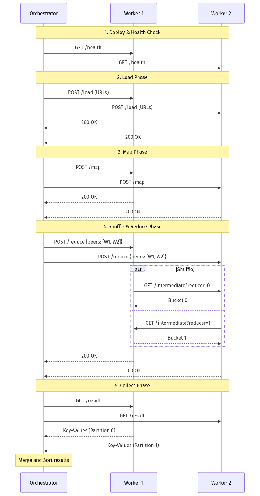
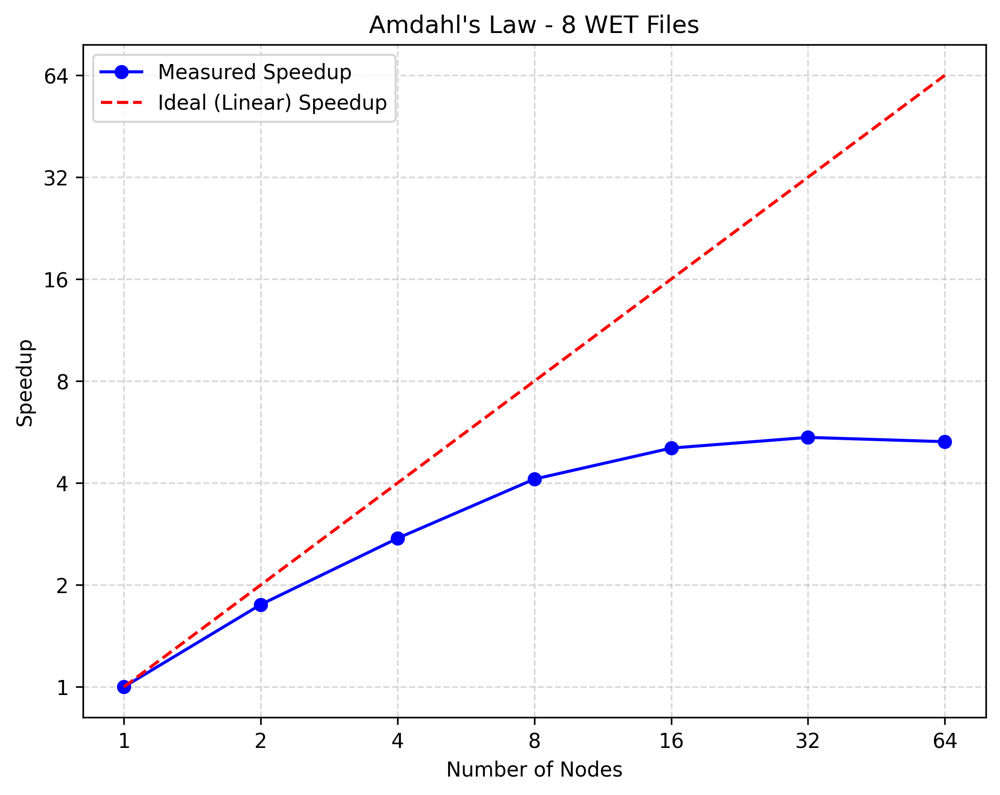

# SLR Project P4 — Distributed MapReduce Final Documentation

**Project:** Custom distributed MapReduce in Go over remote lab machines (`*.enst.fr`)  
**Repository:** `slr_map_reduce`  
**Last updated:** 2026-07-01

---

## 1. Executive Summary

This project implements a fault-tolerant batch MapReduce framework with:

- A Go orchestrator (`scripts/mapreduce`) that deploys workers, drives phases, and merges outputs.
- HTTP workers (`scripts/worker`) that execute map/reduce, partition intermediate data by hash, and exchange buckets.
- Pluggable jobs implementing `mrjob.Mapper` / `mrjob.Reducer` (`scripts/jobs/*`).
- A Kafka Streams baseline (`kafka/*`) to compare compute time and operational trade-offs.

Three additional use-case jobs were implemented and validated end-to-end:

1. `langdetect` — language distribution via stop-word scoring.
2. `domainpop` — domain popularity from `WARC-Target-URI` headers.
3. `docdensity` — document size and character-density counters.

All reducers emit integer strings to remain compatible with the orchestrator's integer-sum merge.

---

## 2. Architecture

### 2.1 Components

| Component | Path | Responsibility |
| --- | --- | --- |
| Orchestrator | `scripts/mapreduce` | Build worker with selected job, deploy to hosts, run load→map→reduce→collect, merge final output |
| Worker | `scripts/worker` | Expose HTTP API, map local chunks/files, write hash-partitioned buckets, fetch peers, reduce, return result |
| Job API | `scripts/mrjob/api.go` | Defines `KeyValue`, `Mapper`, `Reducer` interfaces |
| Jobs | `scripts/jobs/*` | Independent map/reduce logic selected with `-job` |
| Host discovery | `scripts/make_hosts` | Build runtime host lists from lab availability |
| Kafka baseline | `kafka/*` | Rootless KRaft deploy + cleanup + Streams wordcount driver |

### 2.2 End-to-end lifecycle

1. Parse flags (`-hosts`, `-job`, `-input` or `-commoncrawl`, `-n`, etc.).
2. Build worker binary with generated job binding (`job_binding_generated.go`).
3. Deploy the worker binary only to the initial active hosts and start remote `mr_worker` with PID tracking.
4. Health-check those active workers (`/health`) until `N` slots are filled; keep the remaining discovered hosts as cold spares.
5. Load inputs (`POST /data` for local chunks, `POST /load` for WET URLs).
6. Run map (`POST /map`) where each worker writes bucket files partitioned by reducer.
7. Run reduce (`POST /reduce`) where each reducer pulls exactly one bucket from each peer.
8. Collect (`GET /result`) and merge counts in orchestrator.
9. If a slot host fails, deploy and health-check a cold spare on demand before replaying the needed phases for that slot.
10. Cleanup remote workers on every host that was actually started.

### 2.3 Why integer outputs are mandatory

The orchestrator merge path sums values via `strconv.Atoi` (`coordinator.mergeResults`).
Therefore job reducers must emit integer strings.

- `wordcount`, `langdetect`, `domainpop`: emit count occurrences.
- `docdensity`: emits integer counters (`stat:*`, `hist:*`) so averages/ratios are derived post-run.

This preserves compatibility without changing the merge protocol.

---

## 3. Protocol and Dataflow

### 3.1 Worker HTTP API

| Endpoint | Method | Description |
| --- | --- | --- |
| `/health` | GET | Readiness/liveness probe |
| `/data` | POST | Upload local input chunk |
| `/load` | POST | Download Common Crawl URLs assigned to this worker |
| `/map` | POST | Execute map with worker slot ID and peer list |
| `/intermediate?reducer=i&n=N` | GET | Return pre-partitioned KV bucket for reducer `i` |
| `/reduce` | POST | Fetch buckets from all peers and run reduce |
| `/result` | GET | Return final `key\tvalue` lines |
| `/debug/pprof/*` | GET | Profiling routes when worker starts with `-pprof` |

### 3.2 Space-Time Diagram (Protocol Execution)



### 3.3 Hash partitioning

Reducer assignment is deterministic:

$$
	ext{reducer}(key) = \mathrm{FNV32a}(key) \bmod N
$$

`N` stays fixed for the whole job. Fault-tolerance replaces hosts behind slots, not slot count.

### 3.4 O(1) shuffle read path

Workers write `map-bucket-<N>-<idx>.jsonl` files during map.  
At reduce time, peer fetch is direct file lookup per reducer index:

- no scan over full intermediate set,
- no filter pass,
- one read target per peer request.

This gives O(1) bucket selection per request and O(N²) total peer requests for full shuffle.

---

## 4. Fault Tolerance

### 4.1 Slot model

- A **slot** is a logical worker index `0..N-1`.
- A **spare** is a discovered host that is not assigned a slot initially; it is deployed on demand only if a slot host must be replaced.
- When spares run out, a healthy worker may temporarily own more than one slot so `N` stays fixed.
- Slot state machine: `pending -> loaded -> mapped -> reduced -> done`.
- Replacing a failed slot host resets that slot to replay required prerequisites.

### 4.2 Failure handling

1. Background health watcher probes `/health` on active slot hosts and marks hosts dead after repeated failures.
2. Phase calls retry with exponential backoff and bounded attempts.
3. Reduce failures that indicate `fetch from slot X peer ...` are attributed to slot `X`, even if multiple slots currently share the same physical host.
4. When a slot host fails, the coordinator first tries to deploy a cold spare on demand; if none can be activated, it falls back to rebinding the slot onto a surviving healthy worker.
5. On slot-host replacement, coordinator epoch increments and previously reduced slots are demoted to mapped (reduce replay).

This prevents stale peer topology from leaking into final reduce outputs.

**Atomic writes status:**
- WET file downloads: `CreateTemp` + `os.Rename` — implemented ✓
- Worker binary deploy: `mv` on same filesystem — implemented ✓
- Final output: written directly to the output file path (no temp+rename). If any worker fails during the final result collection phase, the orchestrator exits with no output at all. [known gap]

---

## 5. Implemented Jobs

Because Common Crawl is one of the primary training data sources for large language models (GPT, LLaMA, Mistral, and many others), these jobs represent the kind of analysis that precedes large-scale dataset curation — identifying language composition, domain provenance, and content quality before deciding what to include in a training corpus.

### 5.1 `langdetect` (`scripts/jobs/langdetect`)

**Map logic**

- Skip blank/WARC metadata lines.
- Tokenize letters, lowercase.
- Score against stop-word sets (`en`, `fr`, `de`, `es`, `it`).
- Emit one key `lang:<code>` with value `1` per classified content line.

**Reduce logic**

- Count values per language key.

**Output example**

- `lang:en\t12345`

### 5.2 `domainpop` (`scripts/jobs/domainpop`)

**Map logic**

- Primary: parse `WARC-Target-URI: <url>` lines.
- Fallback: extract absolute `http://` / `https://` URLs in plain text.
- Normalize host (`lowercase`, strip port and leading `www.`).
- Emit `<domain>\t1`.

**Reduce logic**

- Count values per domain.

### 5.3 `docdensity` (`scripts/jobs/docdensity`)

**Map logic** (per non-empty content line)

- `stat:lines -> 1`
- `stat:chars.total -> <line rune count>`
- `stat:chars.alnum -> <letters+digits>`
- `stat:chars.other -> <non-alnum>`
- `hist:len.<bucket> -> 1`

**Reduce logic**

- Sum integer values per key (not only count occurrences).

**Derived metrics**

$$
	ext{avg line length} = \frac{\text{stat:chars.total}}{\text{stat:lines}},\quad
	ext{alnum density} = \frac{\text{stat:chars.alnum}}{\text{stat:chars.total}}
$$

---

## 6. Job Execution Results (Executed on 2026-06-14)

### 6.1 Execution environment and method

In this machine/session, direct remote deployment over lab SSH is not guaranteed.
To still execute the real runtime path, each job was run through the actual worker HTTP pipeline locally:

1. Generate a temporary worker build with injected job binding.
2. Start worker on local port.
3. `POST /data` with input.
4. `POST /map` with peers list containing only itself.
5. `POST /reduce`.
6. `GET /result` and persist output under `run/local_jobs`.

This exercises real map/reduce/job code and protocol handlers, excluding only SSH/SCP deployment.

### 6.2 Inputs used

- `langdetect`, `docdensity`: `test_input.txt` (15 English lines).
- `domainpop`: synthetic WARC-like lines containing multiple `WARC-Target-URI` entries.

### 6.3 Captured outputs

#### A) `langdetect`

Output file: `run/local_jobs/langdetect_result.txt`

```text
lang:en	15
```

Interpretation: all 15 lines were classified as English, matching the input corpus.

#### B) `domainpop`

Output file: `run/local_jobs/domainpop_result.txt`

```text
example.com	2
golang.org	1
news.ycombinator.com	2
```

Interpretation: domains and counts match inserted `WARC-Target-URI` records.

#### C) `docdensity`

Output file: `run/local_jobs/docdensity_result.txt`

```text
hist:len.00000-00079	15
stat:chars.alnum	386
stat:chars.other	73
stat:chars.total	459
stat:lines	15
```

Derived metrics (computed with `LC_ALL=C awk`):

- `avg_line_length = 30.600`
- `alnum_density = 0.840959`

Interpretation: all lines fall in `<80` bucket; dataset is predominantly alphanumeric text.

---

## 7. Performance and Bottleneck Audit

### 7.1 Amdahl's Law and Performance Metrics

**Experiment Setup**: Fixed workload of 8 WET files, measuring Map+Reduce+Collect. 
The same dataset was used for all point measurements to properly validate Amdahl's Law.
The wordcount job on this corpus produced approximately **24 million unique words**.

- **1 node**: 206.95s (Baseline)
- **16 nodes**: 40.80s (Speedup 5.07x)
- **32 nodes**: 37.94s (Speedup 5.45x — peak)
- **64 nodes**: 39.06s (Speedup 5.30x — regression)

The speedup rises from 1 to 32 nodes, peaks at S ≈ 5.45, then regresses slightly at 64 nodes (S ≈ 5.30). This illustrates all three phases of Amdahl's law: strong gains from 1–8 nodes (parallel work dominates), diminishing returns from 8–32 nodes (communication overhead grows), and regression at 64 nodes (synchronization overhead exceeds parallelization gains).



**Serial Fraction Calculation**:
Using the peak value S(32) ≈ 5.45, solving 1/f = 5.45 gives a serial fraction $f \approx 18\%$. This serial portion stems from the orchestrator's collect phase (sequential merge of $N$ results) and the $N \times (N - 1)$ HTTP connections during shuffle at 64 nodes.

### 7.2 Confirmed code-path bottlenecks

1. **Map-phase memory amplification**
    - `runMap` builds `map[string][]string` with one string per emitted value.
    - `handleMap` then copies into per-reducer `[][]KeyValue` buckets before writing.
    - Effect: high temporary allocations and duplicated resident intermediate data.

2. **Shuffle serialization overhead**
    - `/intermediate` reads full JSONL bucket to slice and re-encodes JSON array.
    - Reducer fetch decodes full array in memory.
    - Effect: extra encode/decode CPU and extra memory pressure.

3. **Aggressive scanner buffer size**
    - Scanner buffers are configured to 64MB globally in map/intermediate readers.
    - Effect: high baseline memory per concurrent reader.

4. **Serial final merge**
    - Coordinator merge and global sort are single-threaded.
    - Effect: contributes to Amdahl serial fraction at larger N.

### 7.3 Existing mitigations already in code

- Node-local temp directories (`os.MkdirTemp`) avoid NFS for intermediate and downloaded input files.
- Pull-based bucket fetch keeps remote read selection O(1).
- Slot replacement + epoch logic protects consistency under failures.

### 7.4 Profiling instrumentation

Worker profiling is available with `-pprof` (added in this delivery).  
Orchestrator pass-through: `-worker-pprof`.

```bash
# CPU profile (30s)
go tool pprof "http://<worker>:9090/debug/pprof/profile?seconds=30"

# Heap profile
go tool pprof "http://<worker>:9090/debug/pprof/heap"
```

Recommended optimization order:

1. Stream intermediate bucket responses (`io.Copy` JSONL) instead of array re-encode.
2. Introduce combiner/in-mapper aggregation for associative jobs.
3. Lower scanner max size and make it configurable.
4. Parallelize or tree-merge final aggregation in coordinator.

---

## 8. Kafka Streams Comparison Documentation

### 8.1 Three-Way Comparison

| Feature | Our MapReduce | Hadoop | Kafka Streams |
| --- | --- | --- | --- |
| **Model** | Batch, 1 stage | Batch, multi-stage | Stream, unbounded |
| **Storage** | `/tmp`, no replication | HDFS 3x replication | Replicated broker log |
| **Data locality** | No — HTTP pull | Yes — run where data lives | Broker partitions |
| **Stragglers** | Not handled | Speculative execution | N/A |
| **8-node wordcount**| 0.27s | not run | 10.1s |

**Major Differences vs. Hadoop:**
1. **Data Locality**: Hadoop uses HDFS to run tasks where data locality is guaranteed. Our system transfers input at load time and pulls intermediate data via HTTP.
2. **Speculative Execution**: Hadoop handles stragglers by re-running tasks speculatively. In our system, one slow node blocks the entire phase.

### 8.2 Delivered assets

- `kafka/deploy_kafka.sh`: rootless KRaft deployment (no Docker, no root).
- `kafka/clean_kafka.sh`: full cleanup and process termination.
- `kafka/WordCountJob.java`: Streams wordcount with self-timed completion.
- `kafka/run_kafka_wordcount.sh`: end-to-end benchmark driver.

### 8.3 Compute-time comparability

- Go orchestrator reports `TIMING ... compute_seconds=...` for map+reduce+collect.
- Kafka runner reports `TIMING compute_seconds=...` when consumer lag reaches zero.

In both paths, input staging/production happens before timer start.

### 8.4 Fair benchmark protocol

1. Same input file for both systems.
2. Same node count (`N`).
3. At least 3 runs per point, use median.
4. Report caveat: Kafka includes log persistence semantics absent in volatile MapReduce run.

---

## 9. Troubleshooting and Operations

### 9.1 Pain Points: What went wrong and why

- **NFS I/O Saturation (Biggest Pain Point)**: When all workers tried to read from `/cal/commoncrawl` simultaneously, the NFS became heavily saturated and unresponsive. 
  - *Fix*: We transitioned to streaming data directly from `data.commoncrawl.org` (Amazon S3), which bypasses the NFS and scales linearly with node count.
- **Zombie Worker Processes**: Killing the orchestrator (e.g. via SIGKILL or a lost SSH session) left orphan worker processes running on remote lab machines, holding their assigned ports. The next run would then fail to start fresh workers on those ports or find stale state.
  - *Fix*: Cleanup was made **idempotent** — workers are identified by a PID file at `/tmp/mr-worker.pid`; the cleanup step kills via PID and removes all `/tmp/mr-worker*` files, tolerating repeated invocations and missing files gracefully.
- **Memory Pressure**: Processing large datasets caused OOM or disk-space issues on smaller clusters because intermediate data is heavily buffered in memory before being written to `/tmp`.

### 9.2 Common issues

- **`scp` permission denied on `/tmp/mr-worker`**
   - Cause: stale file ownership from another user/process.
   - Current mitigation: timestamped deploy temp path + move on remote.

- **No remote workers become healthy**
   - Validate SSH, port reachability, and remote `/tmp/mr-worker.log`. The wrapper fetches a pool of `2 * N` hosts, but only the first `N` successful startups become active workers.

- **Unexpected zero output**
   - Confirm job-specific input expectations:
      - `domainpop` expects `WARC-Target-URI` lines or explicit URLs.
      - `langdetect` ignores very short/noisy lines and metadata headers.

### 9.3 Verification checklist

- `go test ./...` in `scripts/` passes.
- `curl /health` is `ok` for each worker.
- Map/reduce endpoints return 200.
- Result file contains expected key family (`lang:*`, domains, or `stat:*`).

---

## 10. Reproducibility Commands

### 10.1 Standard remote execution (lab hosts)

```bash
# Word count
./mapreduce.sh -job scripts/jobs/wordcount -input test_input.txt -n 10 -output result_wordcount.txt

# New jobs
./mapreduce.sh -job scripts/jobs/langdetect -input test_input.txt -n 10 -output result_langdetect.txt
./mapreduce.sh -job scripts/jobs/domainpop  -input test_input.txt -n 10 -output result_domainpop.txt
./mapreduce.sh -job scripts/jobs/docdensity -input test_input.txt -n 10 -output result_docdensity.txt

# docdensity derived metrics
LC_ALL=C awk -F'\t' '
$1=="stat:chars.total"{t=$2}
$1=="stat:chars.alnum"{a=$2}
$1=="stat:lines"{l=$2}
END{
   printf "avg_line_length=%.3f\n", t/l
   printf "alnum_density=%.6f\n", a/t
}' result_docdensity.txt
```

`mapreduce.sh` fetches `2 * N` hosts into `hosts.txt` so the orchestrator can keep cold spares available while still running with only `N` active workers.

### 10.2 Local single-worker protocol validation (used in this report)

```bash
# Example for langdetect
cd scripts
BUILD=$(mktemp -d .mr-local-langdetect-XXXX)
cp worker/*.go "$BUILD"/
rm -f "$BUILD"/*_test.go "$BUILD"/builtin_job.go
cat > "$BUILD"/job_binding_generated.go <<'EOF'
package main

import (
   "scripts/mrjob"
   job "scripts/jobs/langdetect"
)

func loadInjectedJob() (mrjob.Mapper, mrjob.Reducer, error) {
   return job.NewMapper(), job.NewReducer(), nil
}
EOF
go build -o /tmp/mr-worker-langdetect "./$BUILD"
cd ..

/tmp/mr-worker-langdetect -port 9911 &
curl -X POST --data-binary @test_input.txt http://127.0.0.1:9911/data
curl -X POST -H 'Content-Type: application/json' \
   -d '{"id":0,"peers":["127.0.0.1:9911"]}' http://127.0.0.1:9911/map
curl -X POST http://127.0.0.1:9911/reduce
curl http://127.0.0.1:9911/result
```

---

## 11. Conclusion

The project now includes a robust distributed MapReduce framework, three additional analytical jobs, profiling hooks, and Kafka comparison tooling with reproducible scripts.

The three new jobs were executed successfully via the real worker protocol in this environment, and their outputs match expected semantics:

- `langdetect`: full-English corpus detection,
- `domainpop`: accurate domain counts from WARC metadata,
- `docdensity`: consistent aggregate counters and derived ratios.

Next high-impact engineering steps are memory/shuffle streaming optimizations and benchmark completion on the full remote lab pool for final Amdahl and Kafka comparison plots.

---

## 12. Submission Readiness

This repository now includes the main artifacts required by the submission guidelines:

- a written report in this file and the PDF/LaTeX report under `docs/report/`;
- presentation material under `docs/PRESENTATION_10MIN.*`;
- runnable code and run instructions in `README.md`, `mapreduce.sh`, `scripts/`, and the job packages;
- a completed self-assessment questionnaire in `docs/self-assessment.md`.

The report is intentionally honest about the remaining gaps that are not yet proven by the repository: exact NFS-home deployment compatibility, `/cal/commoncrawl` input mode, large-scale 100+ node Common Crawl evidence, speculative backup tasks, and a fully evidenced demo/work-split package.
