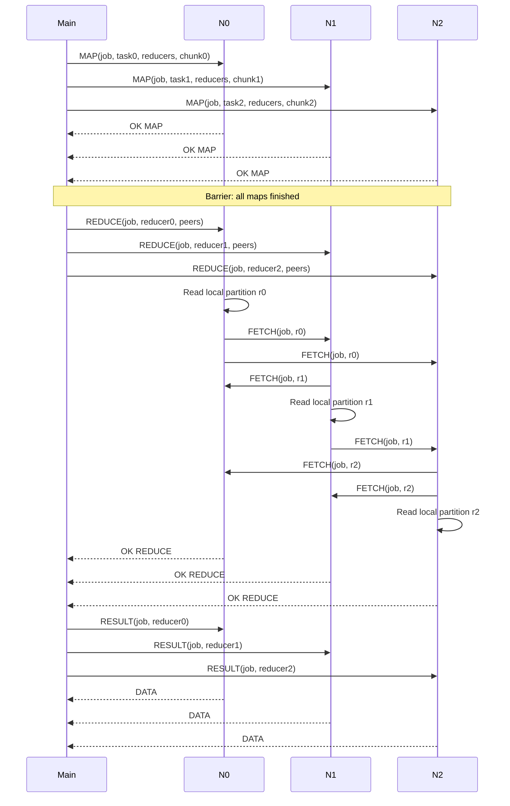

# MapReduce V1 Design

This repository now contains a first, non-fault-tolerant MapReduce path for a word-count workload. The implementation is intentionally simple:

- `Main` is a local coordinator process.
- `N0`, `N1`, `N2`, ... are remote `mr_worker` processes.
- The map phase must finish globally before the reduce phase starts.
- Intermediate map output is written on worker-local disk under `/tmp/slr_map_reduce/<deployment>/<job-id>/...`, not under `$HOME`.
- Reduce ownership follows the rule `hash(key) % effective_reducer_count`.

## Scope

Included in v1:

- Word count only.
- One coordinator and multiple workers.
- Line-oriented TCP protocol.
- Local-disk intermediate files.
- Job-scoped cleanup.

Out of scope in v1:

- Fault tolerance.
- Worker retries.
- Speculative execution.
- Concurrent jobs.
- User-defined map/reduce plug-ins.

## Architecture

1. `mr_coordinator` reads the worker host list and input file.
2. The input is split into chunks of `--chunk-lines` lines.
3. The coordinator computes effective mapper/reducer counts from the input split count and worker pool.
4. Each chunk is assigned to an effective mapper in round-robin order.
5. Each worker tokenizes text into lowercase words and writes `word<TAB>1` records into reducer-partitioned files on local scratch storage.
6. After all maps complete, the coordinator starts one reduce task per effective reducer index.
7. Each reducer fetches its partition from every mapper that actually received map work, aggregates counts, and writes one reducer output file on local scratch storage.
8. The coordinator fetches reducer outputs, globally sorts them, and writes the final result file locally.

See [ADAPTIVE_EXECUTION.md](ADAPTIVE_EXECUTION.md) for the exact policy and operator override.

## Protocol

The protocol is line-oriented ASCII control with optional binary-safe payload bytes after the first line.

### Commands from coordinator to worker

- `PING`
  Health check. Reply: `PONG <worker-id>`

- `MAP <job-id> <task-id> <effective-reducer-count> <payload-bytes>` + payload
  Run one map task on the payload text.
  Reply: `OK MAP <job-id> <task-id> <emitted-records>`

- `REDUCE <job-id> <reducer-id> <peers-bytes>` + payload
  Run one reduce task. `<peers-bytes>` is the byte length of the following payload.
  The payload is a newline-separated list of peers, one per line:
  `<host> <port> <worker-id>`
  The worker fetches its assigned partition from each peer, aggregates counts, and stores the result locally.
  Reply: `OK REDUCE <job-id> <reducer-id> <unique-keys> <total-values> <output-path>`

- `FETCH <job-id> <reducer-id>`
  Return this worker's mapper partition for the given reducer.
  Reply: `DATA <bytes>` + raw partition content

- `RESULT <job-id> <reducer-id>`
  Return this worker's reducer output.
  Reply: `DATA <bytes>` + raw reducer output

### Worker-local file layout

For deployment scratch root `/tmp/slr_map_reduce/<deployment>` and job `job-123`:

- Mapper partitions:
  `/tmp/slr_map_reduce/<deployment>/job-123/maps/worker-<worker-id>-part-<reducer-id>.txt`

- Reducer outputs:
  `/tmp/slr_map_reduce/<deployment>/job-123/outputs/reduce-<reducer-id>.txt`

This satisfies the local-disk requirement from the paper while keeping cleanup precise.

## Space-Time Diagram



## Word Count Example

Input line:

```text
to be or not to be
```

Map emits:

```text
to	1
be	1
or	1
not	1
to	1
be	1
```

Each emitted key is assigned to reducer `hash(key) % effective_reducer_count`.

If `N = 3`:

- `hash("to") % 3` decides which node reduces `to`
- `hash("be") % 3` decides which node reduces `be`
- all identical keys go to the same reducer

Reduce output becomes:

```text
be	2
not	1
or	1
to	2
```

## Operational Flow

1. Deploy workers with `make deploy-mr`.
2. Submit a job with `make run-mr MR_INPUT=<file>`.
3. Clean workers and local scratch state with `make clean-remote-mr`.

The current implementation has been validated locally with one worker on `localhost`. Remote SSH deployment still depends on the same university-host access constraints as the original load-monitor flow.